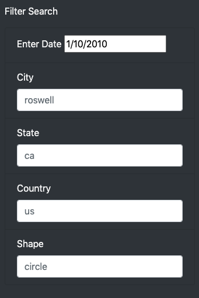

# UFOs

## Overview of the project:

Dana a data journalist wants to write about her hometown and its famous UFO sightings in time for International UFO Day.  The article will be published online along with a JavaScript file filled with UFO sightings.  This file contains location, country, type of sight and other information.  Dana’s goal is to create a dynamic website that uses the JavaScript data allowing a user to filter to the information they wish to see within the website.  She will need a dynamic webpage which filters UFO data based on a search criterion. 

## Results:

The following tools were used for this challenge: JavaScript, CSS, bootstrap, and html.  We were able to help Dana create a dynamic website that filters her UFO data based on filters.  Here is a snapshot of the website below:

As we can see the website begins with an article written by Dana on the “truth” of UFO sightings.  She encourages the individuals to judge whether UFOs are real by reviewing the data for themselves.  The data given to Dana had lots of columns we can use to filter our UFO sightings.  We can filter UFO sighting information by date, city, state, country, or even shape of the UFO.  To aid the user in filtering the data, we added example search cases (see below).  

A user can filter with just one search criteria or drill into the data more by using more than one filter.

List of a few filtering examples: 
1.	Date and City
2.	Date
3.	City
4.	City and State
5.	Shape and Date

The nice thing about this filtering setup is the website clears out the search criteria each time without removing the examples filter for the person.  

## Summary:

The website is fun and a great start for Dana.  A few changes could be made if she wishes to keep the site up for any length of time.

Current drawbacks to the webpage:
1.	The filters are case sensitive.  Currently the filters are setup to read exactly from the data JavaScript file.  Meaning if the data in the file has city in lower case (bakersfield) it will not give a result if (Bakersfield) is used.  
2.	A similar theme comes when we use the date filter.  We must use an exact date to get a result. A user may not have an exact date a sighting was seen. This really reduces the use of the date filter’s usefulness for the user. 

After play on the website, here are a couple of changes I would recommend:
1.	Adjust the filtering to remove the case sensitive issue.  Maybe even allow the search to auto suggest a selection based on what is being written into the field.  
2.	Another possible selection feature would be date ranges instead of a single date.  This could allow a user to grab more information at one time.

