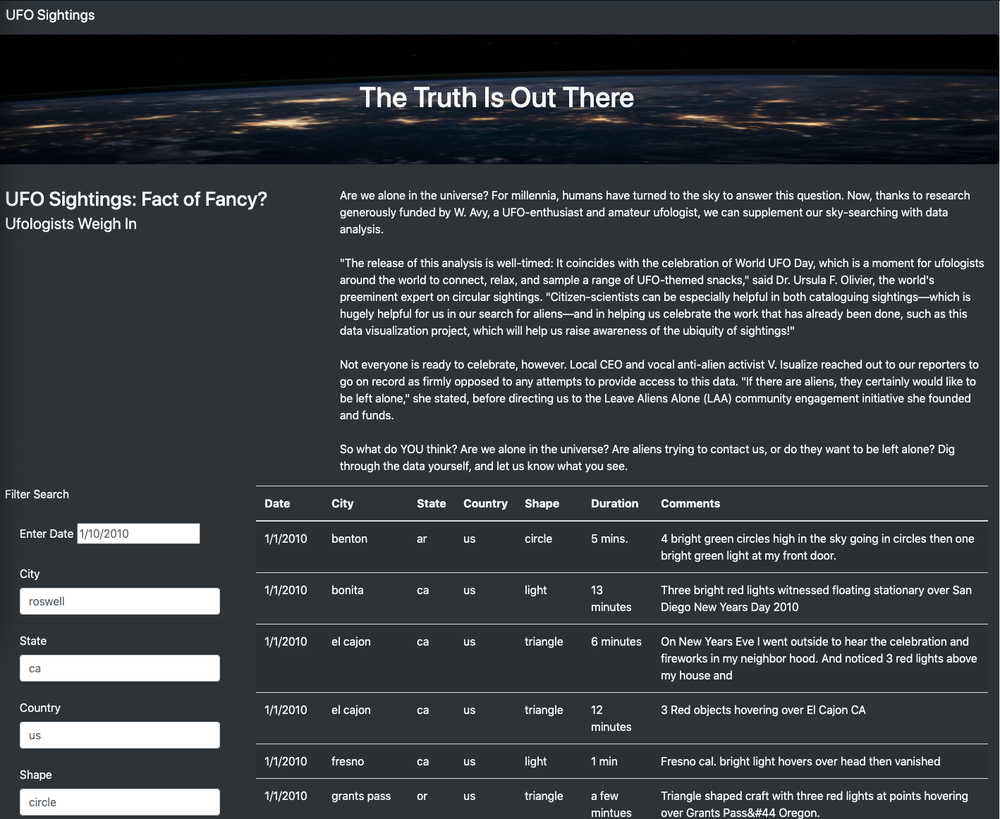

# UFOs

## Overview of the project:

Dana a data journalist wants to write about her hometown and its famous UFO sightings.  The article will be published online.  Dana has been able to obtain a JavaScript file filled with UFO sightings.  This file contains location, country, type of sight and other information.  Dana’s goal is to create a dynamic website that uses the JavaScript data allowing a user to filter to the information they wish to see within the website.  She will need a dynamic webpage which filters UFO data based on a search criterion. 

## Results:

The following tools were used for this challenge: JavaScript, CSS, bootstrap, and html.  We were able to help Dana create a dynamic website that filters her UFO data based on filters.  Here is a snapshot of the website below:

Let's take a closer look at the websites filtering features.  The data given to Dana had lots of columns we can use to filter our UFO sightings.  We can filter by sighting information by date, city, state, country, and even shape of the UFO. 

## Summary:

The summary addresses one drawback of this webpage:
1. case sensivtive 
2. if you use the date, it must be exactly date within the data to get a result.

The summary addresses two additional recommendations for further development:
1. Allow a user to see what years are covered within the dataset.  
